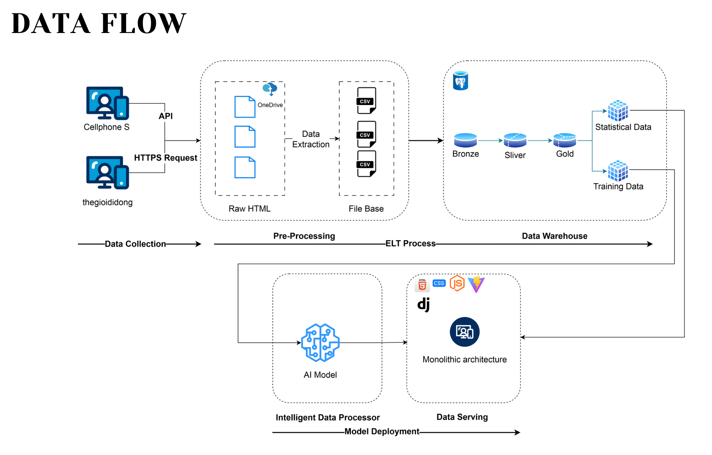
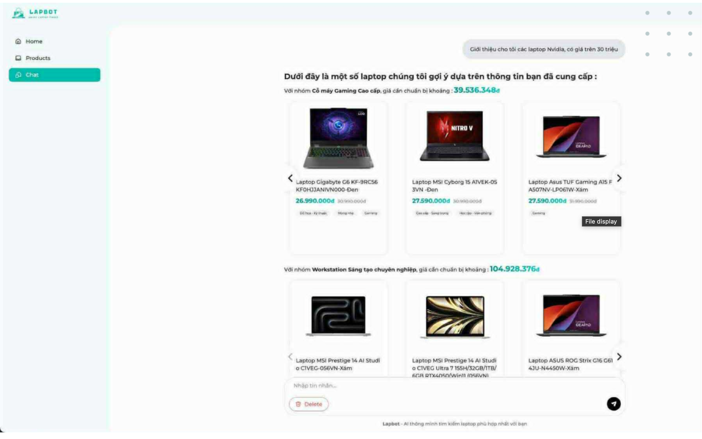

# 💻 LapBot - An AI-powered QA system provides personalized laptop recommendations

[](https://www.google.com/search?q=https://www.python.org/)
[](https://www.google.com/search?q=https://docs.djangoproject.com/)
[](https://www.google.com/search?q=https://www.databricks.com/glossary/medallion-architecture)
[](https://www.google.com/search?q=)

## 📖 Project Overview

**LapBot** is a comprehensive data platform designed to aggregate, process, and analyze laptop market data from Vietnam's leading e-commerce retailers (CellphoneS, The Gioi Di Dong).

The project solves the problem of fragmented and missing technical specifications by implementing a modern **Medallion Data Architecture** and leveraging **Large Language Models (LLMs)** for automated data enrichment. The final product is an intelligent AI Assistant that provides expert laptop recommendations based on real-time market data.



-----

## 🛠 Tech Stack

A sophisticated blend of Data Engineering, Machine Learning, and Modern Web technologies:

  * **Data Engineering:** Scrapy, Selenium (Advanced Crawling), Pandas (ETL/Processing).
  * **Data Architecture:** Medallion Layers (Bronze, Silver, Gold).
  * **AI & Machine Learning:**
      * **LLMs (Gemini 1.5 Flash / Llama 3.3):** Utilized for **Automated Feature Imputation** (inferring missing CPU cores/threads from raw product strings).
      * **XGBoost:** Predictive modeling for price and category classification.
  * **Web Stack:** Django (Robust Backend API), Vite + Tailwind CSS (High-performance Frontend).

-----

## 🏗 Data Architecture (Medallion Pattern)

The pipeline ensures high data quality through three distinct layers:

1.  **Bronze (Raw):** Landing zone for raw HTML and unstructured data from multi-source crawlers.
2.  **Silver (Validated):** Cleaned and standardized data with consistent schemas and handled outliers.
3.  **Gold (Enriched):** Business-ready data enriched by LLM-driven imputation and math-reasoning agents, optimized for the AI Assistant.




-----

## ✨ Key Features

  * **Robust ETL Pipeline:** Fully automated data lifecycle management from ingestion to storage.
  * **AI-Driven Data Imputation:** Innovative use of Gemini/Llama to fill "null" technical specifications with high accuracy, ensuring a 100% complete dataset for the recommendation engine.
  * **Math-Reasoning AI Agent:** A specialized Vietnamese math-solving agent for complex user queries.
  * **Professional EDA:** Deep-dive market analysis including price trends and hardware distribution (Available in `lapbot/src/data_transformation/eda`).

-----

## 🚀 Getting Started

### 1\. Prerequisites

  * Python 3.9+
  * Node.js (v18+) & npm

### 2\. Installation & Setup

```bash
# Clone the repository
git clone https://github.com/your-username/lapbot.git
cd lapbot

# Install Python dependencies
pip install -r requirements.txt

# Run the data crawlers
python lapbot/src/data_collection/cellphones_crawler/main.py
```

### 3\. Running the Web Demo

```bash
# Navigate to the frontend directory
cd lapbot/src/demo

# Install JS dependencies
npm install

# Start the development server
npm run dev
```

-----

## 📂 Project Structure

  * `data/`: Data storage following the Medallion architecture.
  * `src/data_collection/`: Multi-source web scraping scripts.
  * `src/data_transformation/`: Cleaning, parsing, and LLM enrichment logic.
  * `src/demo/`: Full-stack Django/Vite application.

